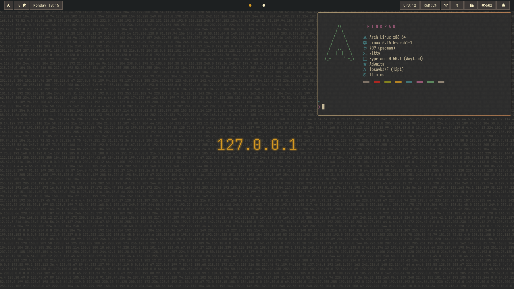

<div align="center">

*Classic • Simple • Functional*

</div>

---

## **Preview**



---

## **What's Included**

This rice features a carefully curated collection of tools and configurations:

### **System Monitoring**
- **btop** - Resource monitor with Gruvbox theming
- **fastfetch** - Clean system information display

### **Window Management** 
- **Hyprland** - Wayland compositor with modular configuration
- **Waybar** - Status bar with custom modules
- **swaync** - Notification center with Gruvbox theming
- **rofi** - Application launcher and dMenu

### **Applications**
- **kitty** - Terminal emulator with Gruvbox colors
- **yazi** - File manager with vim-like keybindings
- **zathura** - PDF viewer

---

## **Installation**

```bash
# Clone the repository
git clone https://github.com/bmichalkiewicz/thinkpad.git
cd thinkpad

# Run the installation script
./install.sh
```
---


<div align="center">

*Feel free to star ⭐ if you found this useful!*

</div>
